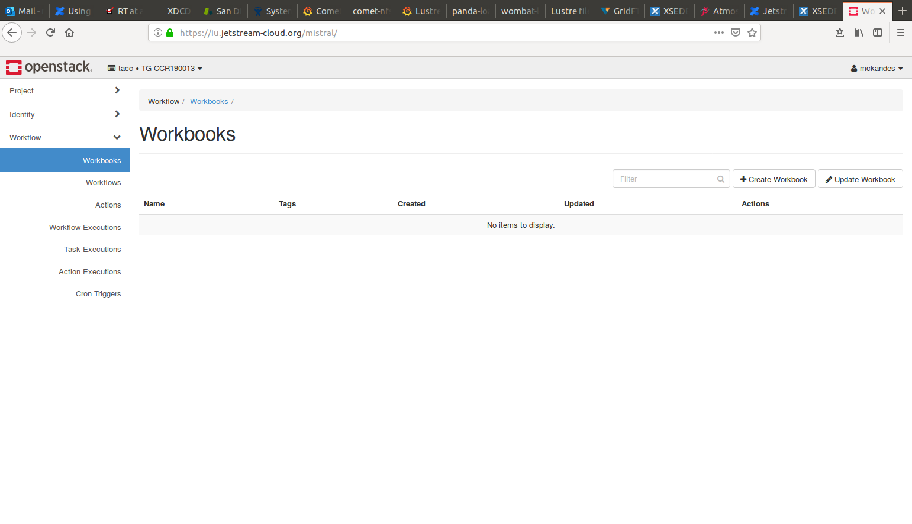

# HPC Training: Spring 2019
Week 8: Friday, May 26th, 2019

## TOPIC: An Introduction to Cloud Computing
Presented by: Dr. Martin Kandes (mkandes@sdsc.edu)

## Setting up access to the jetstream cloud:
* Go to https://iu.jetstream-cloud.org
* Enter 'TACC' for the domain.
* Then use your XSEDE username and password as the login.

If all goes well, you should see a a dashboard like the one below.

 

